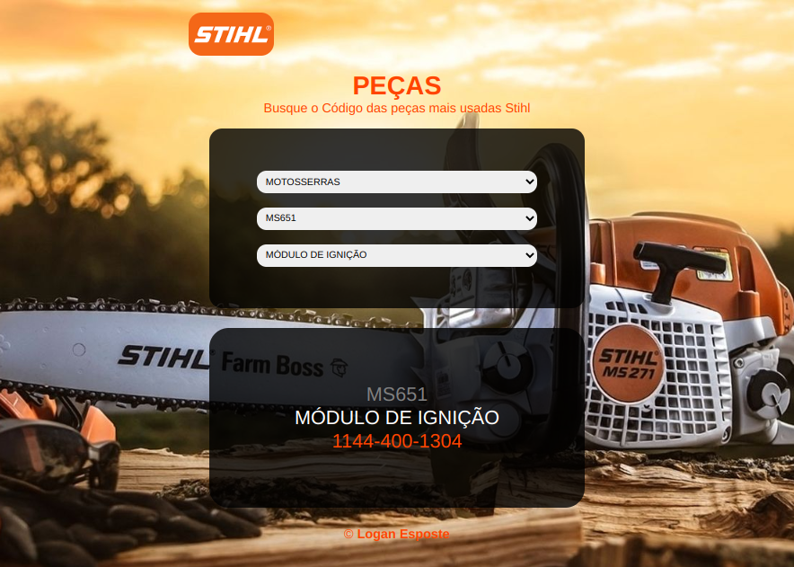

# :orange_square: Peças Stihl

[Acessar Projeto](https://loganesposte.github.io/pecas-stihl)

## :dart: Objetivo

Para apresentar os códigos mais usados das principais máquinas Stihl, foi elaborado uma tela visual e intuitiva para facilitar e agilizar a busca por referência, tornando a experiência (tanto para clientes quanto funcionários) mais agradável.

## :hammer_and_wrench: Tecnologias

- HTML

- CSS

- JAVASCRIPT

## :technologist: Desafios

O mais difícil nessa jornada foi elaborar uma forma de fazer tudo com javascript, pois ainda me falta conhecimento de banco de dados, sabendo que não é uma boa prática colocar todas as informações pertinentes as regras de negócio da aplicação direto no navegador.
Procurei usar muitas funções para as diferentes tarefas do site, para não atribuir muitas obrigações em cada uma delas e facilitar futuras manutenções.

## :new: Próximas Features

- [ ] Adicionar um banco de dados para armazenar os códigos.

- [ ] Separar Front-end e Back-end. 

- [ ] Criar uma API simples para communicação entre back e front. 

## :envelope: Contato

loganesposte@protonmail.com
